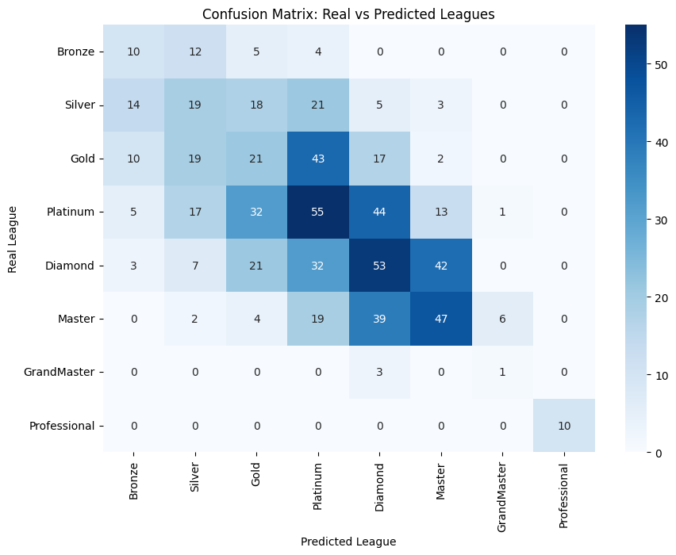
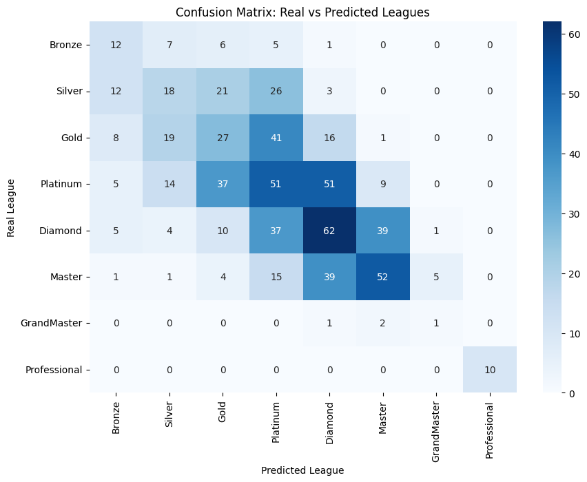
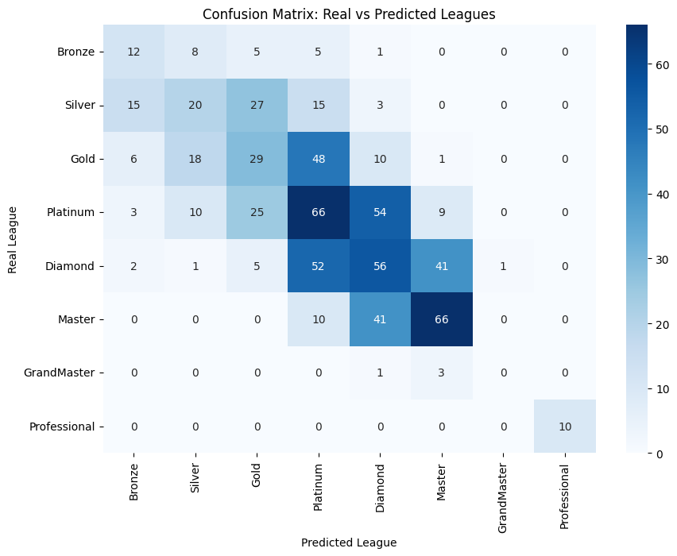
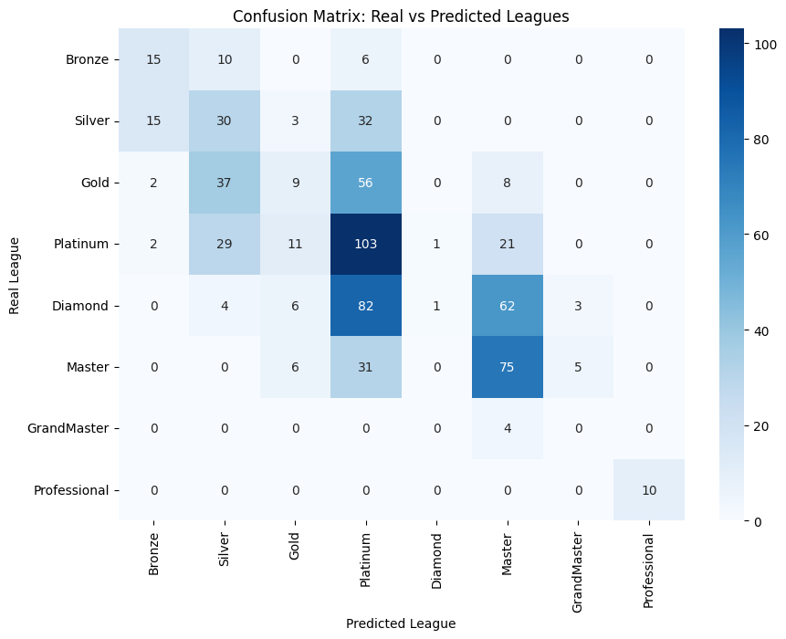
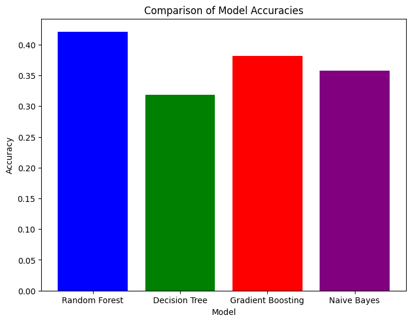

# Common Code Part

## Installing all the packages


```python
!pip install pandas numpy scipy scikit-learn matplotlib seaborn
```

    Defaulting to user installation because normal site-packages is not writeable
    Requirement already satisfied: pandas in c:\users\msi\appdata\local\packages\pythonsoftwarefoundation.python.3.12_qbz5n2kfra8p0\localcache\local-packages\python312\site-packages (2.2.3)
    Requirement already satisfied: numpy in c:\users\msi\appdata\local\packages\pythonsoftwarefoundation.python.3.12_qbz5n2kfra8p0\localcache\local-packages\python312\site-packages (2.1.2)
    Collecting scipy
      Downloading scipy-1.14.1-cp312-cp312-win_amd64.whl.metadata (60 kB)
    Collecting scikit-learn
      Downloading scikit_learn-1.5.2-cp312-cp312-win_amd64.whl.metadata (13 kB)
    Collecting matplotlib
      Downloading matplotlib-3.9.2-cp312-cp312-win_amd64.whl.metadata (11 kB)
    Collecting seaborn
      Downloading seaborn-0.13.2-py3-none-any.whl.metadata (5.4 kB)
    Requirement already satisfied: python-dateutil>=2.8.2 in c:\users\msi\appdata\local\packages\pythonsoftwarefoundation.python.3.12_qbz5n2kfra8p0\localcache\local-packages\python312\site-packages (from pandas) (2.9.0.post0)
    Requirement already satisfied: pytz>=2020.1 in c:\users\msi\appdata\local\packages\pythonsoftwarefoundation.python.3.12_qbz5n2kfra8p0\localcache\local-packages\python312\site-packages (from pandas) (2024.2)
    Requirement already satisfied: tzdata>=2022.7 in c:\users\msi\appdata\local\packages\pythonsoftwarefoundation.python.3.12_qbz5n2kfra8p0\localcache\local-packages\python312\site-packages (from pandas) (2024.2)
    Collecting joblib>=1.2.0 (from scikit-learn)
      Downloading joblib-1.4.2-py3-none-any.whl.metadata (5.4 kB)
    Collecting threadpoolctl>=3.1.0 (from scikit-learn)
      Downloading threadpoolctl-3.5.0-py3-none-any.whl.metadata (13 kB)
    Collecting contourpy>=1.0.1 (from matplotlib)
      Downloading contourpy-1.3.0-cp312-cp312-win_amd64.whl.metadata (5.4 kB)
    Collecting cycler>=0.10 (from matplotlib)
      Downloading cycler-0.12.1-py3-none-any.whl.metadata (3.8 kB)
    Collecting fonttools>=4.22.0 (from matplotlib)
      Downloading fonttools-4.54.1-cp312-cp312-win_amd64.whl.metadata (167 kB)
    Collecting kiwisolver>=1.3.1 (from matplotlib)
      Downloading kiwisolver-1.4.7-cp312-cp312-win_amd64.whl.metadata (6.4 kB)
    Requirement already satisfied: packaging>=20.0 in c:\users\msi\appdata\local\packages\pythonsoftwarefoundation.python.3.12_qbz5n2kfra8p0\localcache\local-packages\python312\site-packages (from matplotlib) (24.1)
    Collecting pillow>=8 (from matplotlib)
      Downloading pillow-11.0.0-cp312-cp312-win_amd64.whl.metadata (9.3 kB)
    Collecting pyparsing>=2.3.1 (from matplotlib)
      Downloading pyparsing-3.2.0-py3-none-any.whl.metadata (5.0 kB)
    Requirement already satisfied: six>=1.5 in c:\users\msi\appdata\local\packages\pythonsoftwarefoundation.python.3.12_qbz5n2kfra8p0\localcache\local-packages\python312\site-packages (from python-dateutil>=2.8.2->pandas) (1.16.0)
    Downloading scipy-1.14.1-cp312-cp312-win_amd64.whl (44.5 MB)
       ---------------------------------------- 0.0/44.5 MB ? eta -:--:--
       ---------------------------------------- 0.3/44.5 MB ? eta -:--:--
       ----- ---------------------------------- 6.6/44.5 MB 25.2 MB/s eta 0:00:02
       ------------ --------------------------- 13.9/44.5 MB 29.1 MB/s eta 0:00:02
       -------------- ------------------------- 16.5/44.5 MB 24.2 MB/s eta 0:00:02
       ------------------- -------------------- 21.5/44.5 MB 24.7 MB/s eta 0:00:01
       ----------------------- ---------------- 26.2/44.5 MB 24.4 MB/s eta 0:00:01
       ---------------------------- ----------- 31.7/44.5 MB 24.6 MB/s eta 0:00:01
       ----------------------------------- ---- 39.8/44.5 MB 26.4 MB/s eta 0:00:01
       ---------------------------------------- 44.5/44.5 MB 26.5 MB/s eta 0:00:00
    Downloading scikit_learn-1.5.2-cp312-cp312-win_amd64.whl (11.0 MB)
       ---------------------------------------- 0.0/11.0 MB ? eta -:--:--
       --------------------------------- ------ 9.2/11.0 MB 43.9 MB/s eta 0:00:01
       ---------------------------------------- 11.0/11.0 MB 38.2 MB/s eta 0:00:00
    Downloading matplotlib-3.9.2-cp312-cp312-win_amd64.whl (7.8 MB)
       ---------------------------------------- 0.0/7.8 MB ? eta -:--:--
       ---------------------------------------- 7.8/7.8 MB 37.3 MB/s eta 0:00:00
    Downloading seaborn-0.13.2-py3-none-any.whl (294 kB)
    Downloading contourpy-1.3.0-cp312-cp312-win_amd64.whl (218 kB)
    Downloading cycler-0.12.1-py3-none-any.whl (8.3 kB)
    Downloading fonttools-4.54.1-cp312-cp312-win_amd64.whl (2.2 MB)
       ---------------------------------------- 0.0/2.2 MB ? eta -:--:--
       ---------------------------------------- 2.2/2.2 MB 41.2 MB/s eta 0:00:00
    Downloading joblib-1.4.2-py3-none-any.whl (301 kB)
    Downloading kiwisolver-1.4.7-cp312-cp312-win_amd64.whl (55 kB)
    Downloading pillow-11.0.0-cp312-cp312-win_amd64.whl (2.6 MB)
       ---------------------------------------- 0.0/2.6 MB ? eta -:--:--
       ---------------------------------------- 2.6/2.6 MB 36.6 MB/s eta 0:00:00
    Downloading pyparsing-3.2.0-py3-none-any.whl (106 kB)
    Downloading threadpoolctl-3.5.0-py3-none-any.whl (18 kB)
    Installing collected packages: threadpoolctl, scipy, pyparsing, pillow, kiwisolver, joblib, fonttools, cycler, contourpy, scikit-learn, matplotlib, seaborn
    Successfully installed contourpy-1.3.0 cycler-0.12.1 fonttools-4.54.1 joblib-1.4.2 kiwisolver-1.4.7 matplotlib-3.9.2 pillow-11.0.0 pyparsing-3.2.0 scikit-learn-1.5.2 scipy-1.14.1 seaborn-0.13.2 threadpoolctl-3.5.0
    

## Checking versions of all the packages


```python
import sklearn
import matplotlib
import seaborn
import pandas as pd
import numpy as np

print("scikit-learn version:", sklearn.__version__)
print("matplotlib version:", matplotlib.__version__)
print("seaborn version:", seaborn.__version__)
print("pandas version:", pd.__version__)
print("numpy version:", np.__version__)
```

    scikit-learn version: 1.5.2
    matplotlib version: 3.9.2
    seaborn version: 0.13.2
    pandas version: 2.2.3
    numpy version: 2.1.2
    

## 1.1 Mount Google Drive and Load the Dataset


```python
# Load the dataset in Jupyter Notebook
import pandas as pd

# Adjust the file path to where your dataset is stored locally
file_path = 'datasets/StarCraft II Replay Analysis.csv'

# Load the dataset into a pandas DataFrame
df = pd.read_csv(file_path)

# Display the first few rows to check if it's loaded correctly
df.head()
```


<div>
<style scoped>
    .dataframe tbody tr th:only-of-type {
        vertical-align: middle;
    }

    .dataframe tbody tr th {
        vertical-align: top;
    }

    .dataframe thead th {
        text-align: right;
    }
</style>
<table border="1" class="dataframe">
  <thead>
    <tr style="text-align: right;">
      <th></th>
      <th>GameID</th>
      <th>LeagueIndex</th>
      <th>Age</th>
      <th>HoursPerWeek</th>
      <th>TotalHours</th>
      <th>APM</th>
      <th>SelectByHotkeys</th>
      <th>AssignToHotkeys</th>
      <th>UniqueHotkeys</th>
      <th>MinimapAttacks</th>
      <th>...</th>
      <th>NumberOfPACs</th>
      <th>GapBetweenPACs</th>
      <th>ActionLatency</th>
      <th>ActionsInPAC</th>
      <th>TotalMapExplored</th>
      <th>WorkersMade</th>
      <th>UniqueUnitsMade</th>
      <th>ComplexUnitsMade</th>
      <th>ComplexAbilityUsed</th>
      <th>MaxTimeStamp</th>
    </tr>
  </thead>
  <tbody>
    <tr>
      <th>0</th>
      <td>52</td>
      <td>5</td>
      <td>27.0</td>
      <td>10.0</td>
      <td>3000.0</td>
      <td>143.7180</td>
      <td>0.003515</td>
      <td>0.000220</td>
      <td>0.000055</td>
      <td>0.000110</td>
      <td>...</td>
      <td>0.004849</td>
      <td>32.6677</td>
      <td>40.8673</td>
      <td>4.7508</td>
      <td>0.000220</td>
      <td>0.001397</td>
      <td>0.000047</td>
      <td>0.0</td>
      <td>0.000000</td>
      <td>127448</td>
    </tr>
    <tr>
      <th>1</th>
      <td>55</td>
      <td>5</td>
      <td>23.0</td>
      <td>10.0</td>
      <td>5000.0</td>
      <td>129.2322</td>
      <td>0.003304</td>
      <td>0.000259</td>
      <td>0.000069</td>
      <td>0.000294</td>
      <td>...</td>
      <td>0.004307</td>
      <td>32.9194</td>
      <td>42.3454</td>
      <td>4.8434</td>
      <td>0.000381</td>
      <td>0.001193</td>
      <td>0.000087</td>
      <td>0.0</td>
      <td>0.000208</td>
      <td>57812</td>
    </tr>
    <tr>
      <th>2</th>
      <td>56</td>
      <td>4</td>
      <td>30.0</td>
      <td>10.0</td>
      <td>200.0</td>
      <td>69.9612</td>
      <td>0.001101</td>
      <td>0.000336</td>
      <td>0.000042</td>
      <td>0.000294</td>
      <td>...</td>
      <td>0.002926</td>
      <td>44.6475</td>
      <td>75.3548</td>
      <td>4.0430</td>
      <td>0.000231</td>
      <td>0.000745</td>
      <td>0.000063</td>
      <td>0.0</td>
      <td>0.000189</td>
      <td>95360</td>
    </tr>
    <tr>
      <th>3</th>
      <td>57</td>
      <td>3</td>
      <td>19.0</td>
      <td>20.0</td>
      <td>400.0</td>
      <td>107.6016</td>
      <td>0.001034</td>
      <td>0.000213</td>
      <td>0.000011</td>
      <td>0.000053</td>
      <td>...</td>
      <td>0.003783</td>
      <td>29.2203</td>
      <td>53.7352</td>
      <td>4.9155</td>
      <td>0.000202</td>
      <td>0.000426</td>
      <td>0.000075</td>
      <td>0.0</td>
      <td>0.000384</td>
      <td>93852</td>
    </tr>
    <tr>
      <th>4</th>
      <td>58</td>
      <td>3</td>
      <td>32.0</td>
      <td>10.0</td>
      <td>500.0</td>
      <td>122.8908</td>
      <td>0.001136</td>
      <td>0.000327</td>
      <td>0.000039</td>
      <td>0.000000</td>
      <td>...</td>
      <td>0.002368</td>
      <td>22.6885</td>
      <td>62.0813</td>
      <td>9.3740</td>
      <td>0.000289</td>
      <td>0.001174</td>
      <td>0.000077</td>
      <td>0.0</td>
      <td>0.000019</td>
      <td>51936</td>
    </tr>
  </tbody>
</table>
<p>5 rows × 21 columns</p>
</div>


## 1.2 Data Preprocessing and Feature Engineering


```python
# Inspect the dataset
df.info()
df.describe()

# Handle missing data (fill missing values with the mean of the columns)
df.fillna(df.mean(), inplace=True)

# Feature engineering: Create Hotkey Efficiency
df['HotkeyEfficiency'] = df['SelectByHotkeys'] / df['AssignToHotkeys']

# Label Encoding for LeagueIndex
from sklearn.preprocessing import LabelEncoder
le = LabelEncoder()
df['LeagueIndex'] = le.fit_transform(df['LeagueIndex'])

# Split features and target
X = df.drop(columns=['LeagueIndex'])
y = df['LeagueIndex']

# Train-Test Split
from sklearn.model_selection import train_test_split
X_train, X_test, y_train, y_test = train_test_split(X, y, test_size=0.2, random_state=42)
```

    <class 'pandas.core.frame.DataFrame'>
    RangeIndex: 3395 entries, 0 to 3394
    Data columns (total 21 columns):
     #   Column              Non-Null Count  Dtype  
    ---  ------              --------------  -----  
     0   GameID              3395 non-null   int64  
     1   LeagueIndex         3395 non-null   int64  
     2   Age                 3340 non-null   float64
     3   HoursPerWeek        3339 non-null   float64
     4   TotalHours          3338 non-null   float64
     5   APM                 3395 non-null   float64
     6   SelectByHotkeys     3395 non-null   float64
     7   AssignToHotkeys     3395 non-null   float64
     8   UniqueHotkeys       3395 non-null   float64
     9   MinimapAttacks      3395 non-null   float64
     10  MinimapRightClicks  3395 non-null   float64
     11  NumberOfPACs        3395 non-null   float64
     12  GapBetweenPACs      3395 non-null   float64
     13  ActionLatency       3395 non-null   float64
     14  ActionsInPAC        3395 non-null   float64
     15  TotalMapExplored    3395 non-null   float64
     16  WorkersMade         3395 non-null   float64
     17  UniqueUnitsMade     3395 non-null   float64
     18  ComplexUnitsMade    3395 non-null   float64
     19  ComplexAbilityUsed  3395 non-null   float64
     20  MaxTimeStamp        3395 non-null   int64  
    dtypes: float64(18), int64(3)
    memory usage: 557.1 KB
    

# Model: Random Forest Classifier

## 2.1 Model Training


```python
def train_model(model, X_train, y_train):
    """Train a given model on the training data."""
    model.fit(X_train, y_train)
    return model

# Random Forest model training
from sklearn.ensemble import RandomForestClassifier
rf_model = RandomForestClassifier(n_estimators=100, random_state=42)
rf_model = train_model(rf_model, X_train, y_train)
```

## 2.2 Model Evaluation


```python
# Evaluation and Visualization
from sklearn.metrics import accuracy_score, classification_report, confusion_matrix
import seaborn as sns
import matplotlib.pyplot as plt

def evaluate_model(model, X_test, y_test):
    """Evaluates the model and plots confusion matrix."""
    # Make predictions
    y_pred = model.predict(X_test)

    # Map league labels to league names
    league_mapping = {
        0: 'Bronze', 1: 'Silver', 2: 'Gold', 3: 'Platinum',
        4: 'Diamond', 5: 'Master', 6: 'GrandMaster', 7: 'Professional'
    }

    # Convert predictions and real values to league names
    y_test_leagues = [league_mapping[league] for league in y_test]
    y_pred_leagues = [league_mapping[league] for league in y_pred]

    # Confusion matrix
    conf_matrix = confusion_matrix(y_test_leagues, y_pred_leagues, labels=list(league_mapping.values()))

    # Plot confusion matrix
    plt.figure(figsize=(10, 7))
    sns.heatmap(conf_matrix, annot=True, fmt="d", cmap="Blues", xticklabels=list(league_mapping.values()), yticklabels=list(league_mapping.values()))
    plt.xlabel('Predicted League')
    plt.ylabel('Real League')
    plt.title('Confusion Matrix: Real vs Predicted Leagues')
    plt.show()

    # Print accuracy and classification report
    print("Accuracy:", accuracy_score(y_test, y_pred))
    print(classification_report(y_test, y_pred, zero_division=1))  # Set zero_division=1 to handle undefined precision

# Evaluate the trained model
evaluate_model(rf_model, X_test, y_test)
```


    

    


    Accuracy: 0.4212076583210604
                  precision    recall  f1-score   support
    
               0       0.52      0.45      0.48        31
               1       0.44      0.24      0.31        80
               2       0.36      0.38      0.37       112
               3       0.35      0.44      0.39       167
               4       0.39      0.41      0.40       158
               5       0.60      0.55      0.57       117
               6       1.00      0.00      0.00         4
               7       1.00      1.00      1.00        10
    
        accuracy                           0.42       679
       macro avg       0.58      0.43      0.44       679
    weighted avg       0.43      0.42      0.42       679
    
    

## 2.3 Model Tuning


```python
# Model tuning using GridSearchCV
from sklearn.model_selection import GridSearchCV
from sklearn.ensemble import RandomForestClassifier

def tune_model(model, param_grid, X_train, y_train):
    """Tune the model using GridSearchCV and return the best model."""
    grid_search = GridSearchCV(model, param_grid, cv=5, n_jobs=-1, verbose=1)  # n_jobs=-1 uses all processors
    grid_search.fit(X_train, y_train)
    return grid_search.best_estimator_

# Expanded hyperparameter grid for Random Forest
param_grid = {
    'n_estimators': [100, 200, 300, 500],  # Test more number of trees
    'max_depth': [10, 20, 30, None],  # None for no depth limit
    'min_samples_split': [2, 5, 10],  # Minimum samples to split a node
    'min_samples_leaf': [1, 2, 4],  # Minimum samples per leaf node
    'bootstrap': [True, False]  # Whether bootstrap samples are used when building trees
}

# Initialize the RandomForestClassifier
rf_model = RandomForestClassifier(random_state=42)

# Hyperparameter tuning using the expanded grid
best_rf_model = tune_model(rf_model, param_grid, X_train, y_train)

# Evaluate the tuned model
evaluate_model(best_rf_model, X_test, y_test)
```

    Fitting 5 folds for each of 288 candidates, totalling 1440 fits
    


    

    


    Accuracy: 0.4212076583210604
                  precision    recall  f1-score   support
    
               0       0.50      0.42      0.46        31
               1       0.45      0.26      0.33        80
               2       0.35      0.34      0.35       112
               3       0.36      0.45      0.40       167
               4       0.38      0.39      0.39       158
               5       0.58      0.57      0.58       117
               6       1.00      0.00      0.00         4
               7       1.00      1.00      1.00        10
    
        accuracy                           0.42       679
       macro avg       0.58      0.43      0.44       679
    weighted avg       0.43      0.42      0.42       679
    
    

# Model: Decision Tree Classifier

## 3.1 Model Training


```python
# Import the Decision Tree model
from sklearn.tree import DecisionTreeClassifier

# Define the function to train the model
def train_model(model, X_train, y_train):
    """Train a given model on the training data."""
    model.fit(X_train, y_train)
    return model

# Initialize and train the Decision Tree model
dt_model = DecisionTreeClassifier(random_state=42)
dt_model = train_model(dt_model, X_train, y_train)
```

## 3.2 Model Evaluation


```python
# Import necessary libraries for evaluation
from sklearn.metrics import accuracy_score, classification_report, confusion_matrix
import seaborn as sns
import matplotlib.pyplot as plt

# Function to evaluate and visualize the model's performance
def evaluate_model(model, X_test, y_test):
    """Evaluates the model and plots confusion matrix."""
    # Make predictions on the test set
    y_pred = model.predict(X_test)

    # League name mapping (as before)
    league_mapping = {
        0: 'Bronze', 1: 'Silver', 2: 'Gold', 3: 'Platinum',
        4: 'Diamond', 5: 'Master', 6: 'GrandMaster', 7: 'Professional'
    }

    # Convert predictions and real values to league names
    y_test_leagues = [league_mapping[league] for league in y_test]
    y_pred_leagues = [league_mapping[league] for league in y_pred]

    # Confusion matrix
    conf_matrix = confusion_matrix(y_test_leagues, y_pred_leagues, labels=list(league_mapping.values()))

    # Plot confusion matrix
    plt.figure(figsize=(10, 7))
    sns.heatmap(conf_matrix, annot=True, fmt="d", cmap="Blues", xticklabels=list(league_mapping.values()), yticklabels=list(league_mapping.values()))
    plt.xlabel('Predicted League')
    plt.ylabel('Real League')
    plt.title('Confusion Matrix: Real vs Predicted Leagues')
    plt.show()

    # Print accuracy and classification report
    print("Accuracy:", accuracy_score(y_test, y_pred))
    print(classification_report(y_test, y_pred))

# Evaluate the trained Decision Tree model
evaluate_model(dt_model, X_test, y_test)
```


    

    


    Accuracy: 0.3181148748159057
                  precision    recall  f1-score   support
    
               0       0.24      0.32      0.27        31
               1       0.25      0.24      0.24        80
               2       0.21      0.19      0.20       112
               3       0.32      0.33      0.32       167
               4       0.33      0.34      0.33       158
               5       0.44      0.40      0.42       117
               6       0.12      0.25      0.17         4
               7       1.00      1.00      1.00        10
    
        accuracy                           0.32       679
       macro avg       0.36      0.38      0.37       679
    weighted avg       0.32      0.32      0.32       679
    
    

## 3.3 Model Tuning


```python
# Model tuning using GridSearchCV
from sklearn.model_selection import GridSearchCV

def tune_model(model, param_grid, X_train, y_train):
    """Tune the model using GridSearchCV and return the best model."""
    grid_search = GridSearchCV(model, param_grid, cv=5)
    grid_search.fit(X_train, y_train)
    return grid_search.best_estimator_

# Define the parameter grid for tuning Decision Tree
param_grid = {
    'max_depth': [5, 10, 15, 20],  # Control the depth of the tree
    'min_samples_split': [2, 5, 10],  # Minimum number of samples required to split an internal node
    'min_samples_leaf': [1, 2, 4]  # Minimum number of samples required to be at a leaf node
}

# Perform hyperparameter tuning
best_dt_model = tune_model(DecisionTreeClassifier(random_state=42), param_grid, X_train, y_train)

# Evaluate the tuned Decision Tree model
evaluate_model(best_dt_model, X_test, y_test)
```


    

    


    Accuracy: 0.3431516936671576
                  precision    recall  f1-score   support
    
               0       0.28      0.39      0.32        31
               1       0.29      0.23      0.25        80
               2       0.26      0.24      0.25       112
               3       0.29      0.31      0.30       167
               4       0.36      0.39      0.37       158
               5       0.50      0.44      0.47       117
               6       0.14      0.25      0.18         4
               7       1.00      1.00      1.00        10
    
        accuracy                           0.34       679
       macro avg       0.39      0.41      0.39       679
    weighted avg       0.35      0.34      0.34       679
    
    

# Model: Gradient Boosting Classifier

## 4.1 Model Training


```python
# Import necessary modules
from sklearn.impute import SimpleImputer

# Create an imputer object with the strategy to fill NaN values (e.g., with the mean of the column)
imputer = SimpleImputer(strategy='mean')

# Fit and transform the training data (this will replace NaNs with the column mean)
X_train_imputed = imputer.fit_transform(X_train)
X_test_imputed = imputer.transform(X_test)

# Now we can use the imputed data to train the Gradient Boosting Classifier
# Define the function to train the model
from sklearn.ensemble import GradientBoostingClassifier

def train_model(model, X_train, y_train):
    """Train a given model on the training data."""
    model.fit(X_train, y_train)
    return model

# Initialize and train the Gradient Boosting model
gb_model = GradientBoostingClassifier(random_state=42)
gb_model = train_model(gb_model, X_train_imputed, y_train)
```

## 4.2 Model Evaluation


```python
# Import SimpleImputer to handle missing values
from sklearn.impute import SimpleImputer
from sklearn.ensemble import GradientBoostingClassifier
from sklearn.metrics import accuracy_score, classification_report, confusion_matrix
import seaborn as sns
import matplotlib.pyplot as plt

# Create an imputer to fill NaN values with the mean of the column
imputer = SimpleImputer(strategy='mean')

# Fit the imputer on the training data and transform the training data
X_train = imputer.fit_transform(X_train)

# Also apply the imputer to the test data
X_test = imputer.transform(X_test)

# Train Gradient Boosting Classifier
gb_model = GradientBoostingClassifier(random_state=42)
gb_model.fit(X_train, y_train)

# Evaluation function
def evaluate_model(model, X_test, y_test):
    """Evaluates the model and plots confusion matrix."""
    # Make predictions
    y_pred = model.predict(X_test)

    # Map league labels to league names
    league_mapping = {
        0: 'Bronze', 1: 'Silver', 2: 'Gold', 3: 'Platinum',
        4: 'Diamond', 5: 'Master', 6: 'GrandMaster', 7: 'Professional'
    }

    # Convert predictions and real values to league names
    y_test_leagues = [league_mapping[league] for league in y_test]
    y_pred_leagues = [league_mapping[league] for league in y_pred]

    # Confusion matrix
    conf_matrix = confusion_matrix(y_test_leagues, y_pred_leagues, labels=list(league_mapping.values()))

    # Plot confusion matrix
    plt.figure(figsize=(10, 7))
    sns.heatmap(conf_matrix, annot=True, fmt="d", cmap="Blues", xticklabels=list(league_mapping.values()), yticklabels=list(league_mapping.values()))
    plt.xlabel('Predicted League')
    plt.ylabel('Real League')
    plt.title('Confusion Matrix: Real vs Predicted Leagues')
    plt.show()

    # Print accuracy and classification report
    print("Accuracy:", accuracy_score(y_test, y_pred))
    print(classification_report(y_test, y_pred))

# Evaluate the Gradient Boosting model
evaluate_model(gb_model, X_test, y_test)
```


    

    


    Accuracy: 0.38144329896907214
                  precision    recall  f1-score   support
    
               0       0.32      0.39      0.35        31
               1       0.35      0.25      0.29        80
               2       0.32      0.26      0.29       112
               3       0.34      0.40      0.36       167
               4       0.34      0.35      0.35       158
               5       0.55      0.56      0.56       117
               6       0.00      0.00      0.00         4
               7       1.00      1.00      1.00        10
    
        accuracy                           0.38       679
       macro avg       0.40      0.40      0.40       679
    weighted avg       0.38      0.38      0.38       679
    
    

## 4.3 Model Tuning


```python
from sklearn.model_selection import GridSearchCV
from sklearn.impute import SimpleImputer

# Function to tune the model using GridSearchCV
def tune_model(model, param_grid, X_train, y_train):
    """Tune the model using GridSearchCV and return the best model."""
    grid_search = GridSearchCV(model, param_grid, cv=5)
    grid_search.fit(X_train, y_train)
    return grid_search.best_estimator_

# Define the parameter grid for tuning Gradient Boosting
param_grid = {
    'n_estimators': [100, 200, 300],  # Number of boosting stages
    'learning_rate': [0.01, 0.1, 0.2],  # Step size shrinkage used to prevent overfitting
    'max_depth': [3, 5, 7],  # Maximum depth of the individual trees
    'min_samples_split': [2, 5, 10]  # Minimum number of samples required to split a node
}

# Impute missing values for X_train and X_test before tuning
imputer = SimpleImputer(strategy='mean')
X_train_imputed = imputer.fit_transform(X_train)
X_test_imputed = imputer.transform(X_test)

# Perform hyperparameter tuning
best_gb_model = tune_model(GradientBoostingClassifier(random_state=42), param_grid, X_train_imputed, y_train)

# Evaluate the tuned Gradient Boosting model
evaluate_model(best_gb_model, X_test_imputed, y_test)
```


    

    


    Accuracy: 0.38144329896907214
                  precision    recall  f1-score   support
    
               0       0.32      0.39      0.35        31
               1       0.35      0.25      0.29        80
               2       0.32      0.26      0.29       112
               3       0.34      0.40      0.36       167
               4       0.34      0.35      0.35       158
               5       0.55      0.56      0.56       117
               6       0.00      0.00      0.00         4
               7       1.00      1.00      1.00        10
    
        accuracy                           0.38       679
       macro avg       0.40      0.40      0.40       679
    weighted avg       0.38      0.38      0.38       679
    
    

# Model: Naive Bayes Classifier

## 5.1 Model Training


```python
# Import necessary libraries
from sklearn.naive_bayes import GaussianNB
from sklearn.impute import SimpleImputer

# Create an imputer object to handle missing values
imputer = SimpleImputer(strategy='mean')

# Impute missing values for X_train and X_test
X_train_imputed = imputer.fit_transform(X_train)
X_test_imputed = imputer.transform(X_test)

# Define the function to train the model
def train_model(model, X_train, y_train):
    """Train a given model on the training data."""
    model.fit(X_train, y_train)
    return model

# Initialize and train the Naive Bayes model
nb_model = GaussianNB()
nb_model = train_model(nb_model, X_train_imputed, y_train)
```

## 5.2 Model Evaluation


```python
# Import necessary libraries for evaluation
from sklearn.metrics import accuracy_score, classification_report, confusion_matrix
import seaborn as sns
import matplotlib.pyplot as plt

# Evaluation function
def evaluate_model(model, X_test, y_test):
    """Evaluates the model and plots confusion matrix."""
    # Make predictions
    y_pred = model.predict(X_test)

    # Map league labels to league names
    league_mapping = {
        0: 'Bronze', 1: 'Silver', 2: 'Gold', 3: 'Platinum',
        4: 'Diamond', 5: 'Master', 6: 'GrandMaster', 7: 'Professional'
    }

    # Convert predictions and real values to league names
    y_test_leagues = [league_mapping[league] for league in y_test]
    y_pred_leagues = [league_mapping[league] for league in y_pred]

    # Confusion matrix
    conf_matrix = confusion_matrix(y_test_leagues, y_pred_leagues, labels=list(league_mapping.values()))

    # Plot confusion matrix
    plt.figure(figsize=(10, 7))
    sns.heatmap(conf_matrix, annot=True, fmt="d", cmap="Blues", xticklabels=list(league_mapping.values()), yticklabels=list(league_mapping.values()))
    plt.xlabel('Predicted League')
    plt.ylabel('Real League')
    plt.title('Confusion Matrix: Real vs Predicted Leagues')
    plt.show()

    # Print accuracy and classification report
    print("Accuracy:", accuracy_score(y_test, y_pred))
    print(classification_report(y_test, y_pred))

# Evaluate the Naive Bayes model
evaluate_model(nb_model, X_test_imputed, y_test)
```


    

    


    Accuracy: 0.35787923416789397
                  precision    recall  f1-score   support
    
               0       0.44      0.48      0.46        31
               1       0.27      0.38      0.32        80
               2       0.26      0.08      0.12       112
               3       0.33      0.62      0.43       167
               4       0.50      0.01      0.01       158
               5       0.44      0.64      0.52       117
               6       0.00      0.00      0.00         4
               7       1.00      1.00      1.00        10
    
        accuracy                           0.36       679
       macro avg       0.41      0.40      0.36       679
    weighted avg       0.38      0.36      0.29       679
    
    

# Comparative Visualization


```python
# Necessary Imports
from sklearn.naive_bayes import GaussianNB
from sklearn.tree import DecisionTreeClassifier
from sklearn.ensemble import RandomForestClassifier, GradientBoostingClassifier
from sklearn.metrics import accuracy_score
import matplotlib.pyplot as plt
import pandas as pd

# Define Model Training Function
def train_model(model, X_train, y_train):
    """Train a given model on the training data."""
    model.fit(X_train, y_train)
    return model

# Define Model Evaluation Function
def evaluate_model(model, X_test, y_test, model_name):
    """Evaluates the model and returns accuracy."""
    # Make predictions
    y_pred = model.predict(X_test)

    # Calculate accuracy
    accuracy = accuracy_score(y_test, y_pred)
    print(f"Accuracy for {model_name}: {accuracy:.2f}")

    return accuracy

# Function to compare models
def compare_models(X_train, X_test, y_train, y_test):
    """Train, evaluate, and compare models using accuracy."""

    # Train and evaluate Random Forest
    rf_model = RandomForestClassifier(n_estimators=100, random_state=42)
    rf_model = train_model(rf_model, X_train, y_train)
    rf_accuracy = evaluate_model(rf_model, X_test, y_test, "Random Forest")

    # Train and evaluate Decision Tree
    dt_model = DecisionTreeClassifier(random_state=42)
    dt_model = train_model(dt_model, X_train, y_train)
    dt_accuracy = evaluate_model(dt_model, X_test, y_test, "Decision Tree")

    # Train and evaluate Gradient Boosting
    gb_model = GradientBoostingClassifier(random_state=42)
    gb_model = train_model(gb_model, X_train, y_train)
    gb_accuracy = evaluate_model(gb_model, X_test, y_test, "Gradient Boosting")

    # Train and evaluate Naive Bayes
    nb_model = GaussianNB()
    nb_model = train_model(nb_model, X_train, y_train)
    nb_accuracy = evaluate_model(nb_model, X_test, y_test, "Naive Bayes")

    # Comparison Bar Plot
    models = ['Random Forest', 'Decision Tree', 'Gradient Boosting', 'Naive Bayes']
    accuracies = [rf_accuracy, dt_accuracy, gb_accuracy, nb_accuracy]

    plt.figure(figsize=(8, 6))
    plt.bar(models, accuracies, color=['blue', 'green', 'red', 'purple'])
    plt.xlabel('Model')
    plt.ylabel('Accuracy')
    plt.title('Comparison of Model Accuracies')
    plt.show()

# Example use of the function
compare_models(X_train_imputed, X_test_imputed, y_train, y_test)
```

    Accuracy for Random Forest: 0.42
    Accuracy for Decision Tree: 0.32
    Accuracy for Gradient Boosting: 0.38
    Accuracy for Naive Bayes: 0.36
    


    

    


```python

```
